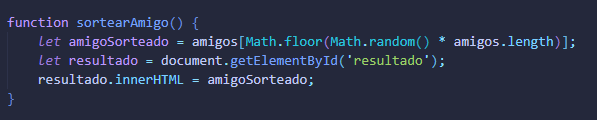

# Desafío Alura

Este proyecto contiene funciones para agregar, mostrar lista y sortear amigos en un juego de amigo secreto.

## Funcionalidades

- **Agregar**: Permite agregar participantes al juego.

- **Mostrar lista**: Muestra la lista de participantes.

- **Sortear amigos**: Realiza el sorteo de amigos secretos.

